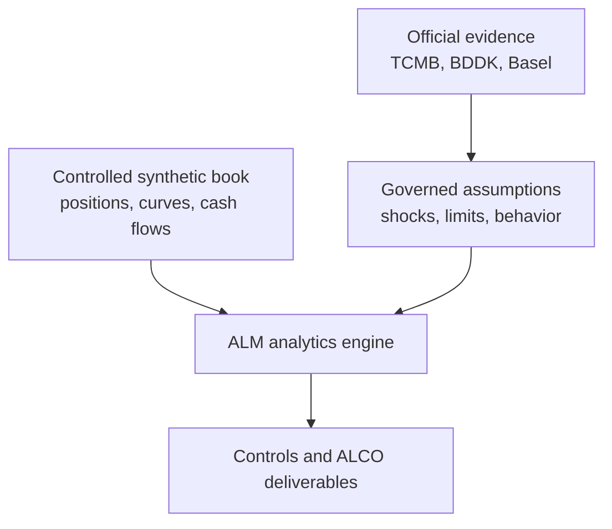

# Aurelia Bank Treasury & ALM Risk Control Tower

[](https://github.com/muratmiracg-dev/aurelia-bank-treasury-alm-risk-control-tower/actions/workflows/ci.yml)
[](https://github.com/muratmiracg-dev/aurelia-bank-treasury-alm-risk-control-tower/actions/workflows/codeql.yml)
[](tests)
[](docs/validation_report.md)
[](pyproject.toml)
[](LICENSE)

**A production-style Treasury and Asset-Liability Management decision-support platform for IRRBB, liquidity stress, FX exposure, hedge analysis and ALCO controls.**

[Türkçe README](README_TR.md) · [Executive deck](presentation/Aurelia_Bank_ALM_Executive_Deck_EN.pptx) · [ALCO workbook](excel/Aurelia_Bank_ALCO_Risk_Workbench.xlsx) · [Executive report](report/Aurelia_Bank_ALM_Executive_Report.pdf)


## Executive finding

The model identifies one formal risk-appetite breach and one management early warning:

- Aggregate absolute FX open position is **33.3% of equity**, above the **20.0%** internal limit.
- Combined-stress LCR proxy falls to **94.8%** and the survival horizon reaches the **30-day** floor.
- Worst EVE loss is **13.7% of Tier 1**, inside the **15.0%** limit but with limited headroom.
- Maximum absolute 12-month NII sensitivity is **5.8%**, inside the **12.0%** limit.

The ALCO response is explicit: remediate FX first, protect liquidity second, then validate the indicative TRY duration hedge before execution.

> This repository is a portfolio-grade analytical demonstration. Aurelia Bank is fictional; bank positions and cash flows are controlled synthetic records. LCR and NSFR outputs are transparent proxies, not regulatory returns. Hedge outputs are decision-support recommendations, not executable trade instructions.

## Why this project exists

Credit-risk projects show how a bank evaluates customers. This project shows how a bank manages its own balance sheet. It connects banking mathematics, data engineering, controls and executive interpretation across:

- repricing and maturity gaps;
- economic value and earnings sensitivity;
- liquidity and structural funding stress;
- foreign-exchange open positions;
- interest-rate and FX hedge overlays;
- data-quality, risk-appetite and model-governance controls.

## Analytical scope

| Module | Implemented analysis | Decision output |
|---|---|---|
| Repricing gap | 19 governed time buckets by TRY, USD and EUR | Asset- vs liability-sensitive buckets |
| Maturity gap | Contractual inflows, outflows and cumulative liquidity gap | Funding concentration and survival pressure |
| IRRBB EVE | Six prescribed Basel scenarios | Delta EVE, Tier 1 impact and binding shock |
| IRRBB NII | 12-month parallel-up/down sensitivity | Delta NII and earnings-at-risk signal |
| DV01 | Currency and bank-level present-value sensitivity | Risk concentration and hedge sizing input |
| Liquidity | Base, idiosyncratic, market-wide and combined stress | LCR proxy and survival horizon |
| Structural funding | ASF and RSF factor model | NSFR proxy |
| FX risk | TRY-equivalent open positions and four FX shocks | Equity usage and stress P&L |
| Hedging | IRS and FX swap/forward reduction heuristics | Before/after exposure and ALCO review status |
| Controls | Data-quality and risk-appetite assertions | Pass, within-limit or breach evidence |

## Verified analytical snapshot

All amounts are TRY million unless stated otherwise. The snapshot is reproducible with seed `20260819` and data cutoff `2026-08-19`.

| Metric | Result | Threshold | Status |
|---|---:|---:|---|
| Total assets | 180,000.0 | Accounting identity | Reconciled |
| Customer deposits | 120,500.0 | n/a | Base funding source |
| Worst Delta EVE | (3,092.4) | 15.0% of Tier 1 | 13.7% - within limit |
| Worst Delta NII | (1,324.9) | 12.0% of baseline NII | 5.8% - within limit |
| Base LCR proxy | 158.7% | 100.0% | Within formal control |
| Combined LCR proxy | 94.8% | 100.0% management floor | Early warning |
| Combined survival horizon | 30 days | 30 days | At floor |
| NSFR proxy | 143.4% | 100.0% | Within limit |
| Aggregate FX open / equity | 33.3% | 20.0% | **Breach** |
| Data-quality controls | 10 / 10 | All pass | Pass |
| Automated tests | 43 | 90% coverage gate | 94.88% coverage |

## Data architecture



The data classes are never blended silently:

| Data class | Contents | Repository location |
|---|---|---|
| Official observation | TCMB policy rate and FX snapshot | [`data/external/tcmb_market_snapshot.csv`](data/external/tcmb_market_snapshot.csv) |
| Official benchmark | BDDK June 2026 sector snapshot | [`data/external/bddk_sector_snapshot.csv`](data/external/bddk_sector_snapshot.csv) |
| Official methodology | Basel IRRBB, LCR and NSFR frameworks | [`docs/data_provenance.md`](docs/data_provenance.md) |
| Controlled synthetic | Bank positions, curves and cash flows | [`data/demo`](data/demo) |
| Derived analytics | Risk metrics, controls and recommendations | [`artifacts/results`](artifacts/results) |

## Deliverables

| Deliverable | Purpose |
|---|---|
| [`excel/Aurelia_Bank_ALCO_Risk_Workbench.xlsx`](excel/Aurelia_Bank_ALCO_Risk_Workbench.xlsx) | Formula-linked 11-tab ALCO workbook with charts, controls and sources |
| [`presentation/Aurelia_Bank_ALM_Executive_Deck_EN.pptx`](presentation/Aurelia_Bank_ALM_Executive_Deck_EN.pptx) | Editable 12-slide executive decision pack |
| [`report/Aurelia_Bank_ALM_Executive_Report.pdf`](report/Aurelia_Bank_ALM_Executive_Report.pdf) | Ten-page sourced ALCO report |
| [`artifacts/aurelia_alm_demo.sqlite`](artifacts/aurelia_alm_demo.sqlite) | Portable analytical database |
| [`powerbi`](powerbi) | DAX measures, theme and implementation specification |
| [`sql`](sql) | PostgreSQL-style schema, views and analytical queries |
| [`artifacts/figures`](artifacts/figures) | Reproducible management visuals |
| [`docs`](docs) | Methodology, provenance, validation, risk register and ALCO playbook |

Power BI assets are intentionally source-controlled as transparent DAX, theme and dashboard specifications. The repository does not claim that an unverified `.pbix` or `.pbip` file has been rendered.

## Quick start

Requirements: Python 3.11 or newer.

```bash
python -m venv .venv
source .venv/bin/activate
python -m pip install --upgrade pip
python -m pip install -e ".[dev]"
make verify
```

`make verify` performs the full quality gate:

1. checks formatting and lint rules with Ruff;
2. runs the 43-test Pytest suite with a 90% coverage threshold;
3. regenerates deterministic demo data and analytical outputs;
4. validates required files, control results and SHA-256 checksums.

Run individual workflows:

```bash
# Regenerate the complete analytical snapshot
aurelia-alm run --root . --seed 20260819

# Print the current executive summary
aurelia-alm show --root .

# Start the read-only API
make api
```

API examples:

```bash
curl http://localhost:8000/health/ready
curl http://localhost:8000/api/v1/summary
curl http://localhost:8000/api/v1/irrbb/eve
curl http://localhost:8000/api/v1/liquidity
curl http://localhost:8000/api/v1/hedges
```

Set `AURELIA_API_KEY` to require the `X-API-Key` header. See [`.env.example`](.env.example).

## Repository structure

```text
.
├── config/                 # Shocks, behavioral assumptions and limits
├── data/
│   ├── demo/               # Deterministic synthetic positions and cash flows
│   └── external/           # Versioned official public-data snapshots
├── src/aurelia_alm/        # Analytics, controls, pipeline, API and CLI
├── tests/                  # Unit, integration and API tests
├── artifacts/              # Results, figures, SQLite database and summary
├── sql/                    # Schema, views and analytical queries
├── powerbi/                # DAX, theme and report specification
├── excel/                  # ALCO workbook
├── presentation/           # Executive deck
├── report/                 # Executive PDF report
└── docs/                   # Methodology, governance and portfolio narrative
```

## Methodology and governance

- [Methodology](docs/methodology.md) documents formulas, sign conventions and model boundaries.
- [Data provenance](docs/data_provenance.md) records every official source and synthetic classification.
- [Validation report](docs/validation_report.md) states passed checks and known validation limits.
- [Risk register](docs/risk_register.md) separates model, data, market and execution risks.
- [ALCO playbook](docs/alco_playbook.md) turns metrics into governed decisions.
- [Data dictionary](docs/data_dictionary.md) defines the position and output fields.

### Primary references

- [Basel Committee - Recalibration of shocks for interest rate risk in the banking book](https://www.bis.org/bcbs/publ/d578.pdf)
- [BIS - Liquidity Coverage Ratio framework](https://www.bis.org/basel_framework/chapter/LCR/20.htm)
- [BIS - Net Stable Funding Ratio framework](https://www.bis.org/basel_framework/chapter/NSF/20.htm)
- [TCMB EVDS](https://evds3.tcmb.gov.tr/)
- [TCMB official exchange rates via e-Devlet](https://www.turkiye.gov.tr/doviz-kurlari)
- [BDDK monthly banking sector bulletin](https://www.bddk.org.tr/BultenAylik/tr/Home/HaberBulteni)

## Engineering quality

- deterministic generation and checksum manifest;
- configuration-driven assumptions and limits;
- typed package, CLI and read-only FastAPI service;
- SQLite and SQL analytical layers;
- 43 automated tests and 94.88% line coverage;
- Ruff formatting and linting;
- GitHub Actions CI and CodeQL security analysis;
- Dockerfile and Compose configuration;
- explicit non-production and non-regulatory boundaries.

## License

Released under the [MIT License](LICENSE).

---

Built by **Murat Miraç Gedik** as a Banking, Treasury, ALM and Risk Analytics portfolio project.

