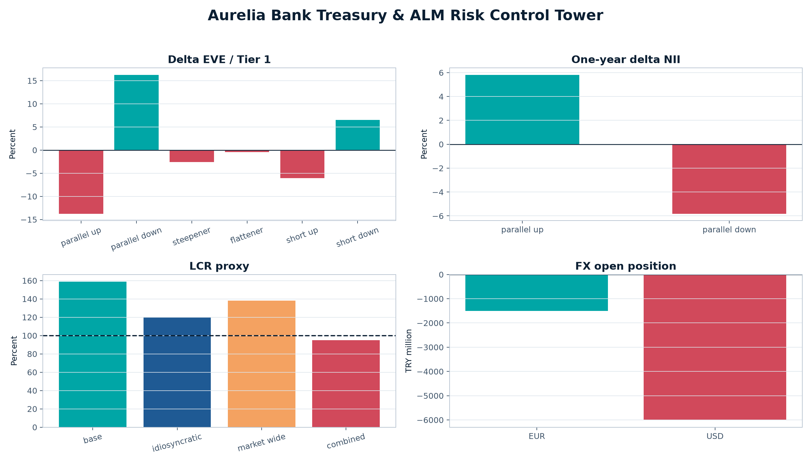

# Aurelia Bank Hazine & ALM Risk Kontrol Kulesi

[English README](README.md) · [Yönetim sunumu](presentation/Aurelia_Bank_ALM_Executive_Deck_EN.pptx) · [ALCO Excel modeli](excel/Aurelia_Bank_ALCO_Risk_Workbench.xlsx) · [PDF rapor](report/Aurelia_Bank_ALM_Executive_Report.pdf)

**IRRBB, likidite stresi, döviz açık pozisyonu, hedge analizi ve ALCO kontrollerini tek bir denetlenebilir karar destek platformunda birleştiren üretim kalitesinde portföy projesi.**



## Yönetici özeti

Model bir resmî risk iştahı ihlali ve bir yönetim erken uyarısı üretiyor:

- Toplam mutlak döviz açık pozisyonu özkaynağın **%33,3'ü**; iç limit **%20,0**.
- Birleşik stres altında LCR vekil oranı **%94,8'e** düşüyor ve hayatta kalma süresi **30 günlük** tabana ulaşıyor.
- En kötü EVE kaybı Tier 1 sermayenin **%13,7'si**; **%15,0** limitin içinde fakat tampon sınırlı.
- Bir yıllık en yüksek mutlak NII duyarlılığı **%5,8**; **%12,0** limitin içinde.

ALCO aksiyonu nettir: önce FX riskini azalt, sonra likidite tamponunu koru, son olarak TRY duration hedge büyüklüğünü doğrula ve ancak yönetişim kontrollerinden sonra işleme al.

> Aurelia Bank kurgusal bir bankadır. Banka pozisyonları ve nakit akışları kontrollü sentetik kayıtlardır. LCR ve NSFR çıktıları açıklamalı vekil oranlardır; düzenleyici rapor değildir. Hedge çıktıları karar desteğidir; doğrudan işlem talimatı değildir.

## Proje kapsamı

| Alan | Analiz | ALCO çıktısı |
|---|---|---|
| Yeniden fiyatlama açığı | TRY, USD ve EUR için 19 vade dilimi | Aktif/pasif duyarlılığı |
| Vade açığı | Sözleşmesel giriş, çıkış ve kümülatif açık | Fonlama baskısı |
| IRRBB EVE | Basel'in öngördüğü altı faiz şoku | Delta EVE ve Tier 1 etkisi |
| IRRBB NII | 12 aylık paralel yukarı/aşağı şok | Gelir duyarlılığı |
| DV01 | Para birimi ve banka toplamı | Risk yoğunluğu ve hedge girdisi |
| Likidite | Baz, bankaya özgü, piyasa geneli ve birleşik stres | LCR vekili ve hayatta kalma süresi |
| Yapısal fonlama | ASF ve RSF faktörleri | NSFR vekili |
| FX riski | Açık pozisyon ve dört kur şoku | Özkaynak kullanımı ve stres P&L |
| Hedge | IRS ve FX swap/forward risk azaltma senaryoları | Önce/sonra karşılaştırması |
| Kontroller | Veri kalitesi ve risk iştahı testleri | Pass, limit içi veya ihlal |

## Doğrulanmış sonuçlar

Tutarlar aksi belirtilmedikçe milyon TL'dir. Üretim tohumu `20260819`, veri kesim tarihi `2026-08-19`.

| Metrik | Sonuç | Limit | Durum |
|---|---:|---:|---|
| Toplam aktif | 180.000,0 | Muhasebe eşitliği | Mutabık |
| Mevduat | 120.500,0 | - | Ana fonlama kaynağı |
| En kötü Delta EVE | (3.092,4) | Tier 1'in %15,0'i | %13,7 - limit içinde |
| En kötü Delta NII | (1.324,9) | NII'nin %12,0'si | %5,8 - limit içinde |
| Baz LCR vekili | %158,7 | %100,0 | Limit içinde |
| Birleşik LCR vekili | %94,8 | %100,0 yönetim tabanı | Erken uyarı |
| Birleşik hayatta kalma süresi | 30 gün | 30 gün | Tabanda |
| NSFR vekili | %143,4 | %100,0 | Limit içinde |
| FX açık pozisyon / özkaynak | %33,3 | %20,0 | **İhlal** |
| Veri kalitesi kontrolleri | 10 / 10 | Tamamı geçmeli | Başarılı |
| Otomatik testler | 43 | %90 kapsam eşiği | %94,88 kapsam |

## Veri yaklaşımı

Proje üç veri sınıfını açık biçimde ayırır:

- **Resmî gözlemler:** TCMB politika faizi ve döviz kurları.
- **Resmî karşılaştırma:** BDDK Haziran 2026 sektör görünümü.
- **Kontrollü sentetik veri:** Aurelia Bank pozisyonları, eğrileri ve nakit akışları.

Kaynaklar ve sınıflandırmalar [veri kökeni dokümanında](docs/data_provenance.md) kayıtlıdır. Böylece sentetik banka verisi gerçek piyasa gözlemi gibi sunulmaz.

## Teslimatlar

| Dosya | İçerik |
|---|---|
| [ALCO Excel çalışma kitabı](excel/Aurelia_Bank_ALCO_Risk_Workbench.xlsx) | Formül bağlantılı 11 sekme, grafikler, kontroller ve kaynaklar |
| [Yönetim sunumu](presentation/Aurelia_Bank_ALM_Executive_Deck_EN.pptx) | Düzenlenebilir 12 slaytlık karar paketi |
| [PDF yönetim raporu](report/Aurelia_Bank_ALM_Executive_Report.pdf) | Kaynaklandırılmış 10 sayfalık ALCO raporu |
| [SQLite veritabanı](artifacts/aurelia_alm_demo.sqlite) | Taşınabilir analitik veri katmanı |
| [Power BI varlıkları](powerbi) | DAX ölçüleri, tema ve dashboard tasarımı |
| [SQL katmanı](sql) | Şema, view ve analitik sorgular |
| [Yöntem ve yönetişim](docs) | Metodoloji, doğrulama, risk kaydı ve ALCO playbook |

## Kurulum ve çalıştırma

Python 3.11 veya üzeri gerekir.

```bash
python -m venv .venv
source .venv/bin/activate
python -m pip install --upgrade pip
python -m pip install -e ".[dev]"
make verify
```

Tam analitik snapshot'ı yeniden üretmek için:

```bash
aurelia-alm run --root . --seed 20260819
```

Salt okunur API'yi başlatmak için:

```bash
make api
```

`make verify`; Ruff kalite kontrolünü, 43 Pytest testini, %90 kapsam eşiğini, deterministik veri üretimini ve SHA-256 dosya doğrulamasını birlikte çalıştırır.

## Yöntem ve yönetişim dokümanları

- [Metodoloji](docs/methodology.md)
- [Veri kökeni](docs/data_provenance.md)
- [Doğrulama raporu](docs/validation_report.md)
- [Risk kaydı](docs/risk_register.md)
- [ALCO karar playbook'u](docs/alco_playbook.md)
- [Veri sözlüğü](docs/data_dictionary.md)

## Temel resmî kaynaklar

- [Basel IRRBB şok kalibrasyonu](https://www.bis.org/bcbs/publ/d578.pdf)
- [BIS LCR çerçevesi](https://www.bis.org/basel_framework/chapter/LCR/20.htm)
- [BIS NSFR çerçevesi](https://www.bis.org/basel_framework/chapter/NSF/20.htm)
- [TCMB EVDS](https://evds3.tcmb.gov.tr/)
- [TCMB resmî döviz kurları](https://www.turkiye.gov.tr/doviz-kurlari)
- [BDDK aylık bankacılık bülteni](https://www.bddk.org.tr/BultenAylik/tr/Home/HaberBulteni)

## Lisans

[MIT Lisansı](LICENSE) ile yayımlanmıştır.

---

**Murat Miraç Gedik** tarafından Bankacılık, Hazine, ALM ve Risk Analitiği portföy projesi olarak geliştirilmiştir.

